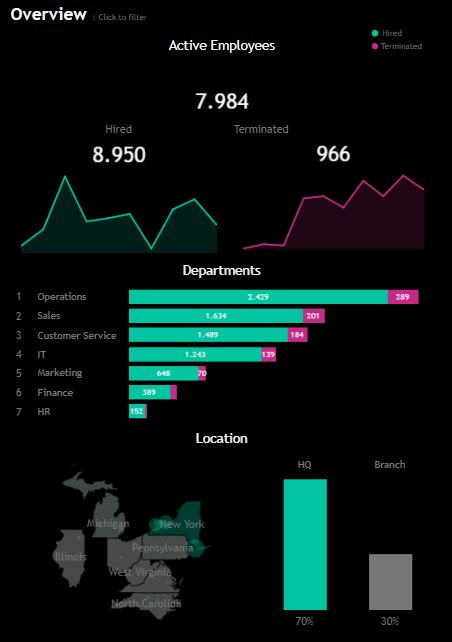
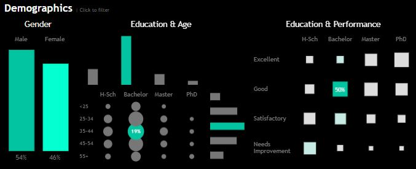
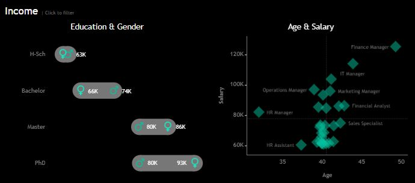

# HR analysis for a US company

## Background and overview

TechWave Logistics, since 2015 specializes in providing comprehensive logistics solutions, including inventory management, transportation coordination, and supply chain optimization. The company is recognized for its commitment to operational excellence and customer satisfaction.

The organization has a huge quantity of detailed and informing HR data. This project goes deep into that information to optimize talent management and improve operational efficiency. Employee performance, turnover rates, and training data are cumulatively analyzed in order for the management to identify patterns that can help support intelligent decisions on hiring and career development. Predictive analytics, on the one hand, enables foresight into the demands of the market and allows one to modulate the HR strategy to have every branch sufficiently staffed to meet customer expectations. This will translate into greater customer satisfaction, along with a more motivated and productive work environment, further improving the performance of the construction company.

The following insights and recommendations touch upon salient focus areas:

- General analysis: Provides metrics about the total number of employees, active employees, terminated employees, etc.

- Demographic analysis: Provides metrics on the composition of the workforce.

- Revenue analysis: Provides metrics related to the salary of the workforce.

Two dashboards were built to give management information to better the decision-making in the company, one serves general HR deployment, while the other provides a detailed insight into the employees. The data was synthetically generated using Python's Faker library. 

## Data Structure and Initial Checks

TechWave Logistics has 8,950 observations, each representing a company employee, including active and terminated employees since the company's inception. It contains 15 columns with information on NicaTex's human resources, including:

| **Column**            | **Purpose**                                                                                                       |
|-----------------------|-------------------------------------------------------------------------------------------------------------------|
| Employee ID           | A unique identifier                                                                                            |
| First Name            | The first name of the employee                                                                                            |
| Last Name             | The last name of the employee                                                                                            |
| Gender                | The gender of the employee                        |
| State                 | The state where the employee comes from                                                           |
| City                  | The city where the employee comes from                                                            |
| Education             | The education of the employee (BSc, MSc, PhD, etc.)                                                          |
| Birthdate             | The birth date of the employee           |
| Hiredate              | The hire date of the employee                                 |
| Termdate              | The term data of the employee|
| Department            | The department where the employee works                                                                       |
| Job Title             | The job that the employee has assigned in the company                                                        |
| Salary                | The salary paid to the employee                                                                                |
| Performance Rating    | The performance of the employee (Needs Improvement, Satisfactory, Good, Excellent)                            |

## Executive summary

### Overview of Findings

TechWave Logistics has 8,950 employees, of which 7,950 were active, 1,000 have been terminated. Most of the hiring occurred in 2017, and the
 terminations in 2024. Most employees are in operations. The highest concentration of workforce is in Managua. More than half of
 the workforce is men, who fall in the age range of 35 to 44 years. Male employees earn more at each level of education. Salaries rise
 due to age and experience. The first dashboard provides an overview. This interactive dashboard can be explored in detail [here](https://public.tableau.com/views/hr-case-study/HRSummary?:language=es-ES&:sid=&:redirect=auth&:display_count=n&:origin=viz_share_link).

### General Analysis

- The company holds 8,950 positions, 7,984 of which are active, and 966 have been terminated. The majority of the personnel currently active were hired in 2017,
 representing 19.55% or 1,560. Few employees were hired in the pandemic, compared to other years, 5.27% or 421. The majority of the 1,000 former employees were terminated
 in 2023, 17.4% or 174. 

- The department with the largest number of active employees is Operations, with 2,429, or 27% of the work force. 

- The majority of the workforce are from the state of New York, with 6,270 (78.6%), and New York city, with 1,458 (23.29%). 

- The majority of the workforce operates in the HQ in New York, with 6,270 (70%).

### Demographic Analysis

- The workforce is composed in more than half by men (54%), or 4,801 employees.

- The majority of the workforce holds a bachelor degree (61%), or 5,418 employees.

- In terms of age distribution, slightly more than one-third (31%) of employees have between 35 and 44 years of age, accounting for 2,764 employees.

- Almost a quarter of the workforce (19%) falls in the 35 to 44 age category and hold a bachelor's degree holders: 1,661 employees.

- Bachelor's degree-holders constitute the category of employees with the best performances in different measurement scales.

### Income analysis

- Male employees, earn 10.2% more on each level of education, have an average annual income of $79,000 compared to $71,750 for females.

- Another significant observation from the present data is that age is positively correlated to the salary in each job position the employee holds. As an employee works upwards in each department, salary increases. 

## Recommendations

These are the recommendations based on the results obtained:

- Analysis of termination causes: The cause behind the fact that 19% of employees have ended their employment relationship this year must be determined.

- Retention programs: Create and implement retention programs for employees hired in 2017, as they represent a significant percentage of the active workforce. Incentives or opportunities for advancement within the company could be offered.

- Geographical expansion: Given that 72% of employees are concentrated in Managua, exploring opportunities to diversify the workforce in other regions could be beneficial. This can not only reduce dependence on a single location but also open up new business opportunities.

- Programs for ongoing training: Since 61% of workers have a bachelor's degree, it is essential to provide ongoing training so that workers can develop their abilities and progress in their jobs. This could include classes pertaining to their particular fields or soft skills like collaboration and leadership. 

- Predictive analytics is suggested to be used in the future to either create a list of candidates for promotions or to anticipate employee turnover.  

The dashboards are inspired by the one made by [Baraa Khatib Sakini in this video](https://www.youtube.com/watch?v=UcGF09Awm4Y).

 